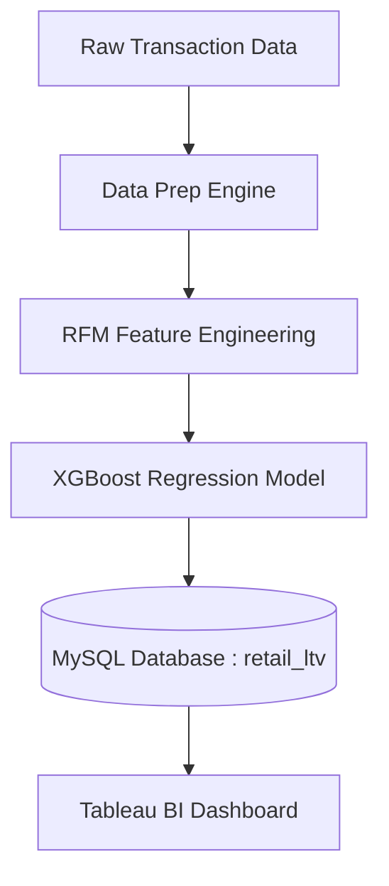
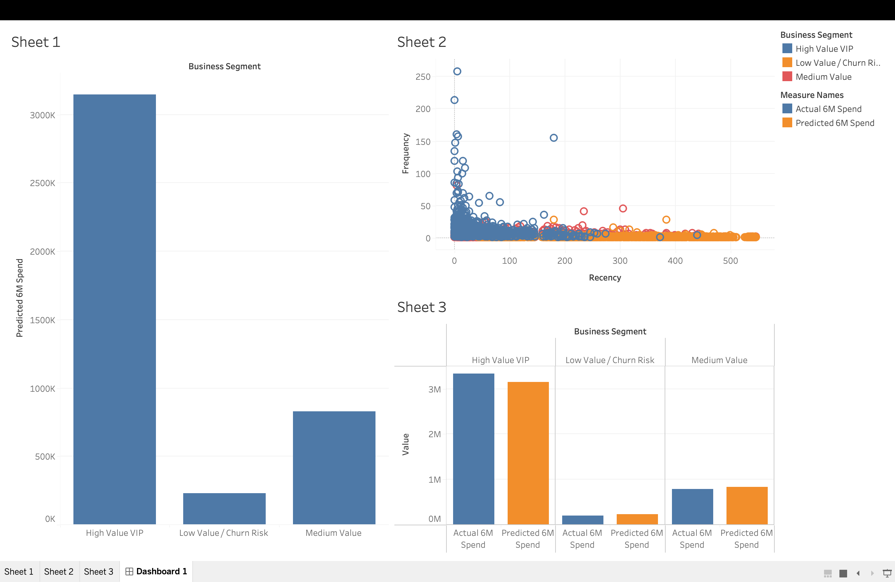
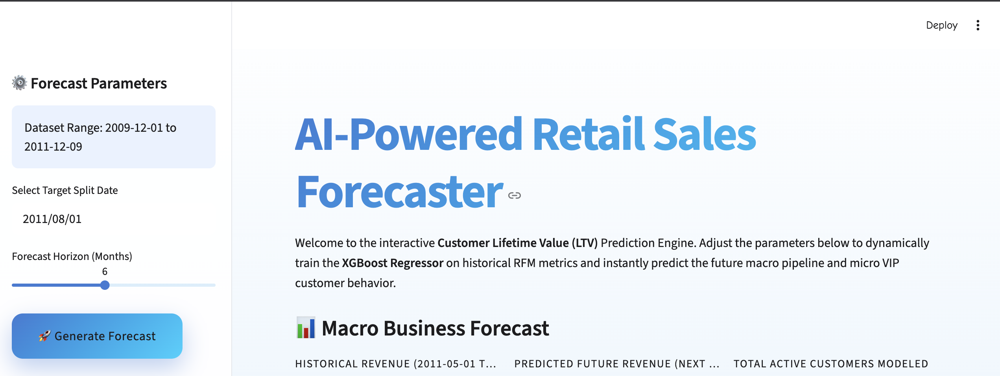
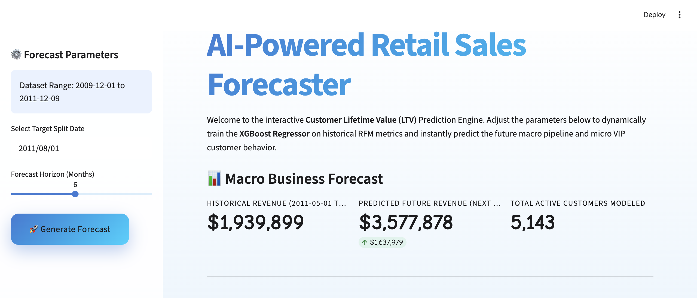
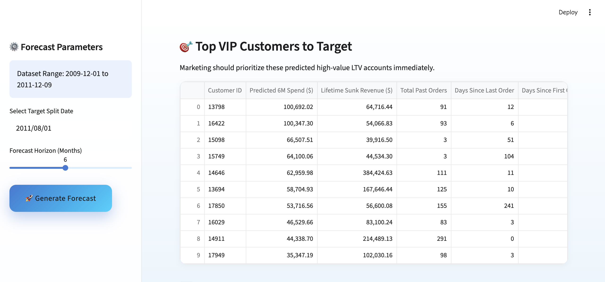
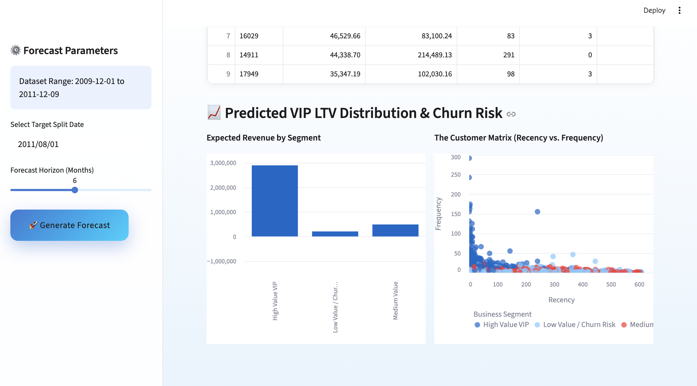

# 📈 Customer Lifetime Value (LTV) Prediction Pipeline


An end-to-end Machine Learning and Business Intelligence pipeline that predicts future customer revenue to optimize marketing budget allocation. 

**Dataset:** UCI Online Retail II (800k+ real transactional rows)

---

## 🏗️ Architecture



## 📁 Project Structure

```
Project-2/
├── data/                       
│   ├── online_retail_II.xlsx   # Raw dataset (1M rows)
│   ├── cleaned_retail.csv      # Processed baseline
│   ├── rfm_features.csv        # Feature Store Matrix
│   └── ltv_predictions.csv     # Model outputs (Target for BI)
├── src/
│   ├── data_prep.py            # Phase 1: Cleans anomalies
│   ├── feature_engineering.py  # Phase 2: Calculates RFM
│   ├── train_model.py          # Phase 3: XGBoost ML
│   ├── db_loader.py            # Phase 4: MySQL Export
│   └── pipeline.py             # Main Orchestrator
├── .env                        # Secure database credentials
├── requirements.txt
└── README.md
```

## 🚀 Setup & Run

### Prerequisites
- Python 3.8+
- MySQL Server (running locally)
- Tableau Desktop / Tableau Public

### Installation

```bash
cd Project-2
python3 -m venv venv
source venv/bin/activate
pip install -r requirements.txt
```

### Run the Pipeline

```bash
source venv/bin/activate
python src/pipeline.py
```

### 🌐 Launch the Interactive Web App (Streamlit)

To open the interactive AI forecasting web dashboard in your browser:

```bash
source venv/bin/activate
streamlit run src/app.py
```

### 🖼️ Project Screenshots (Output Gallery)







## 📊 Business Intelligence (Tableau)

The final predictive output is served via MySQL (`retail_ltv` database) to Tableau. The associated dashboard visualizes:
1. Expected Revenue Yield from Top 10% VIP Segments
2. RFM cluster distributions
3. High Churn-Risk Customer Identification

## 🤖 Predictive Modeling Strategy

### Feature Engineering (RFM)
We time-split the dataset, calculating observation metrics on the first 1.5 years of data:
- **Recency:** Days since the customer's last purchase.
- **Frequency:** Total number of unique orders placed.
- **Monetary:** Total distinct revenue generated.
- **Tenure:** Days since the customer's first purchase.

The **Target Variable ($y$)** is isolated as the exact revenue each customer generated in the *future 6-month prediction window*.

### Optimization (Apple Silicon M2)
The **XGBoost Regressor** is explicitly optimized for modern ARM architectures (like the Apple M2) by bypassing standard exact greedy algorithms and utilizing `tree_method='hist'`. This leverages deep CPU multi-threading across all efficiency/performance cores (`n_jobs=-1`) to compute 150 ensemble trees natively without explicit external GPU offloading.

## 🎯 Skills Demonstrated
Matches Core Business Requirements for Data Analytics:
- **Data Engineering:** `pandas` feature store extraction from 1 million transactional rows
- **Predictive Analytics:** Target windowing and Gradient Boosting (`xgboost`)
- **SQL & Architecture:** Automated MySQL local server staging
- **Business Reporting:** Actionable BI customer segmentation
